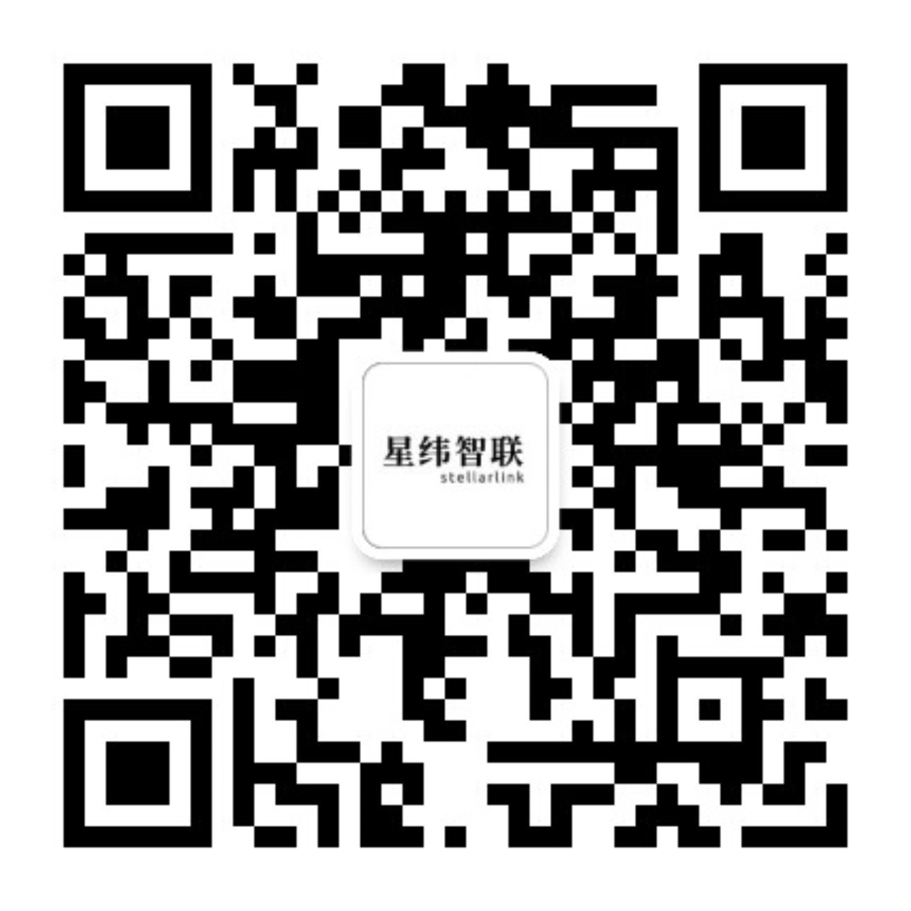
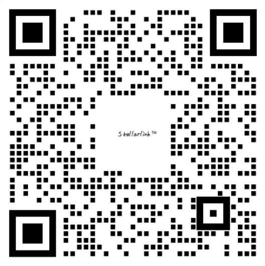

# 星纬智联 · StellarLink

**AI 产品与 AI Agent 应用落地服务**

[English](README.md) · [简体中文](README_ZH.md)

[官网](https://stellarlink.co) · [联系我们](https://stellarlink.co/contact)

---

## 关于我们

重庆星纬智联科技有限公司（StellarLink）围绕客户获取、微信经营、CRM 跟进、云端编码 Agent 和生产级 AI Agent 应用落地，提供 AI 产品与交付服务。

---

## 产品与服务

<table>
<tr>
<td width="50%">

### AI 微信小程序

**AI 驱动微信经营。**

面向获客、商城、点餐、预约、会员、支付与私域复购的小程序产品化交付。把微信流量、交易、客户标签和运营跟进串成一个可持续迭代的业务闭环。

[了解更多](https://stellarlink.co/products/miniprogram)

</td>
<td width="50%">

### 销冠AI

**AI 增长与销售运营系统。**

销冠AI 覆盖 GEO 品牌曝光、抖音与小红书自动获客、微信私域运营、CRM 跟进管理，把公域内容流量转化为可追踪线索、会话、商机与销售管线。

[了解更多](https://stellarlink.co/products/geo-optimize)

</td>
</tr>
<tr>
<td width="50%">

### SWEAgent

**异步云端开发，交付前自动扫描安全风险。**

从代码托管平台（当前支持 GitHub）自动触发编码、验证与安全扫描。Agent 异步运行、自动检测漏洞、记录验证证据并交付可审查 PR，在交付前暴露风险，保障代码质量。

[了解更多](https://stellarlink.co/products/sweagent)

</td>
<td width="50%">

### AI Agent 应用落地服务

**从场景识别到生产集成的完整交付。**

帮助企业从 AI 机会评估、流程重构、Agent 架构设计、MVP 验证、生产系统集成，到交付培训与持续运营，把 AI Agent 真正落到业务流程里。

[了解更多](https://stellarlink.co/products/fde)

</td>
</tr>
</table>

---

## 公司信息

| 项目 | 当前信息 |
|------|----------|
| 公司 | 重庆星纬智联科技有限公司 |
| 定位 | Technology-Driven AI Company |
| 服务企业 | 1,000+ |
| 平均成本降低 | 47% |
| 平均效率提升 | 10x |
| 小程序能力 | AI 驱动微信经营 |
| ICP 备案 | 渝ICP备2025052875号 |

---

## 联系我们

邮箱：[support@stellarlink.co](mailto:support@stellarlink.co)  
电话：[+86-17764045684](tel:+8617764045684)  
官网：[stellarlink.co](https://stellarlink.co)  
地址：重庆市两江新区康美街道金开大道西段 106 号 9 幢 22 楼 2205-1 室

<table>
<tr>
<td align="center" width="50%">

 
<a>微信公众号</a>
</td>
<td align="center" width="50%">

 
<a>企业微信</a>
</td>
</tr>
</table>

---

© 2026 重庆星纬智联科技有限公司. All rights reserved.

